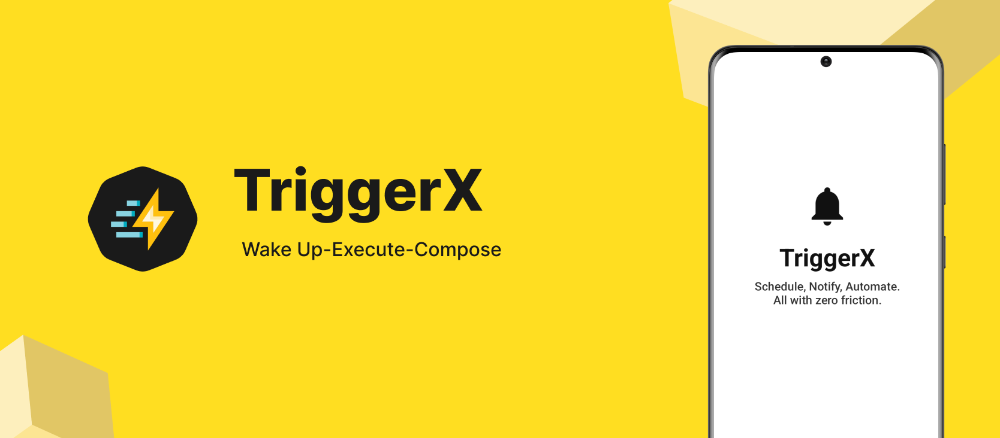

# TriggerX



<p align="center">
  <a href="https://central.sonatype.com/artifact/com.meticha/triggerx">
  
  </a>
  
  
  <a href="https://github.com/Meticha/TriggerX/blob/main/LICENSE">
    
  </a>
  <a href="https://github.com/Meticha/TriggerX/stargazers">
    
  </a>
  <a href="https://opensource.org/licenses/Apache-2.0">
    
</a>
</p>


> **Note:** TriggerX is currently in Alpha. APIs may change.

TriggerX is a modular, developer-friendly **alarm execution** library for Android.

It simplifies scheduling exact alarms and showing user-facing UIs at a specific time, even when
your app has been killed or without you managing foreground-service boilerplate, wake-locks, or
lock-screen flags.

## Example

<p>
  
</p>

---

## 📌 What does TriggerX do?

|                                                                                   |                                                                      |
|-----------------------------------------------------------------------------------|----------------------------------------------------------------------|
| ⏰ **Exact alarms** that work in Doze (API 25+)                                    | 🔓 **Lock-screen activity** automatically shown when the alarm fires |
| 🔑 Handles permissions: exact alarm, battery optimisations, overlay, notification | 📱 Wakes the device, starts a foreground service, then stops it      |
| 🔄 Fetches fresh data at alarm time via `suspend` provider (Room, API, …)         | 🎨 Lets you build the UI in **Jetpack Compose**                      |

Think of TriggerX as an execution layer that runs a piece of UI logic at the right time and hides
the system details.

---

## ✅ When should you use TriggerX?

|                                                                                 |                                                                 |
|---------------------------------------------------------------------------------|-----------------------------------------------------------------|
| 📅 You need to show a UI (reminder, alert, action screen) **at a given time**   | 🔄 The UI needs **live data** from DB, cache, or API            |
| 🧹 You want to avoid edge-case handling for Doze, foreground services, or flags | 🎯 You want a consistent alarm solution across Android versions |

---

### 📦 Installation

<details>
<summary>Version catalogs</summary>

```toml
[versions]
triggerx = "0.0.4"

[dependencies]
triggerx = { module = "com.meticha:triggerx", version.ref = "triggerx" }
```

</details>

<details>
<summary>Gradle DSL</summary>

```kotlin
dependencies {
    implementation("com.meticha:triggerx:0.0.4")
}
```

</details>

## 🚀 Quick Start

### 0. Add these permission in your `AndroidManifest.xml` file:

```xml

<uses-permission android:name="android.permission.REQUEST_IGNORE_BATTERY_OPTIMIZATIONS" />

    <!-- For displaying an Activity over other apps/lock screen -->
<uses-permission android:name="android.permission.SYSTEM_ALERT_WINDOW" />

    <!-- Permissions for scheduling exact alarms -->
<uses-permission android:name="android.permission.SCHEDULE_EXACT_ALARM" />
```

### 1. Initialize in your Application class

```kotlin
class MyApplication : Application() {
    override fun onCreate() {
        super.onCreate()

        TriggerX.init(this) {

            /* UI that opens when the alarm fires */
            activityClass = MyAlarmActivity::class.java

            /* Foreground-service notification */
            useDefaultNotification(
                title = "Alarm running",
                message = "Tap to open",
                channelName = "Alarm Notifications"
            )

            /* Optional: Provide up-to-date data right before the UI opens */
            alarmDataProvider = object : TriggerXDataProvider {
                override suspend fun provideData(alarmId: Int, alarmType: String): Bundle {
                    return when (alarmType) {
                        "MEETING" -> {
                            val meeting = meetingRepository.getMeeting(alarmId)
                            return bundleOf(
                                "title" to meeting?.title,
                                "location" to meeting?.location
                            )
                        }

                        else -> bundleOf()
                    }
                }
            }
        }
    }
}
```

### 2. Ask for the permission

The library provides a composable helper to request permissions so that you don't have to manage
this manually. However, the library provides the functionality to request permissions manually if
you want to follow that path

```kotlin
@Composable
fun HomeScreen(
    viewModel: HomeViewModel = hiltViewModel()
) {
    val context = LocalContext.current
    val permissionState = rememberAppPermissionState()


    Scaffold { paddingValues ->
        Column(
            modifier = Modifier
                .fillMaxSize()
                .padding(paddingValues)
                .padding(16.dp),
            verticalArrangement = Arrangement.Center,
            horizontalAlignment = Alignment.CenterHorizontally
        ) {
            ElevatedButton(
                onClick = {
                    if (permissionState.allRequiredGranted()) {
                        viewModel.scheduleOneMinuteAlarm(context)
                    } else {
                        permissionState.requestPermission()
                    }
                }
            ) {
                Text("Schedule Activity")
            }
        }
    }
}
```

### 3. Schedule an alarm

```kotlin
val inFiveMinutes = Calendar.getInstance().apply {
    add(Calendar.MINUTE, 5)
}.timeInMillis


TriggerXAlarmScheduler().scheduleAlarm(
    context = this,
    alarmId = 1,
    type = "MEETING",
    triggerAtMillis = inFiveMinutes
)
```

💡 You can schedule many alarms with different alarmId / alarmType.

## 🧩 Create your Alarm UI

```kotlin
class AppAlarmActivity : TriggerXActivity() {

    @Composable
    override fun AlarmContent() {
        val bundle = remember { intent?.getBundleExtra("ALARM_DATA") }
        val title = bundle?.getString("title") ?: "empty title"
        val location = bundle?.getString("location")
        Box(
            modifier = Modifier.fillMaxSize()
        ) {
            Column(
                modifier = Modifier
                    .fillMaxSize()
                    .background(
                        color = Color.White,
                        shape = RoundedCornerShape(32.dp)
                    )
                    .padding(32.dp),
                verticalArrangement = Arrangement.Center,
                horizontalAlignment = Alignment.CenterHorizontally
            ) {
                Icon(
                    imageVector = Icons.Default.Notifications,
                    contentDescription = "Trigger Icon",
                    tint = Color(0xFF111111),
                    modifier = Modifier.size(80.dp)
                )

                Spacer(modifier = Modifier.height(24.dp))

                Text(
                    text = title,
                    fontSize = 42.sp,
                    fontWeight = FontWeight.Bold,
                    color = Color(0xFF111111)
                )

                Spacer(modifier = Modifier.height(12.dp))

                Text(
                    text = location ?: "empty location",
                    fontSize = 20.sp,
                    fontWeight = FontWeight.Medium,
                    color = Color(0xFF333333),
                    textAlign = TextAlign.Center
                )
            }
        }
    }
}
```

What the base class handles for you:

- 🔓 Shows over lock-screen
- 📱 Turns screen on
- ⚙️ Chooses correct flags per Android version
- 📦 Receives & parses Bundle (“ALARM_DATA”)

## 🔐 Permissions

TriggerX includes a Composable helper to request what it needs.

```kotlin
@Composable
fun HomeScreen(
    viewModel: HomeViewModel = hiltViewModel()
) {
    val context = LocalContext.current
    val permissionState = rememberAppPermissionState()


    Scaffold { paddingValues ->
        Column(
            modifier = Modifier
                .fillMaxSize()
                .padding(paddingValues)
                .padding(16.dp),
            verticalArrangement = Arrangement.Center,
            horizontalAlignment = Alignment.CenterHorizontally
        ) {
            ElevatedButton(
                onClick = {
                    if (permissionState.allRequiredGranted()) {
                        viewModel.scheduleOneMinuteAlarm(
                            context
                        )
                    } else {
                        permissionState.requestPermission()
                    }
                }
            ) {
                Text("Schedule Activity")
            }
        }
    }
}
```

Covered automatically:

| Permission                     | Version |
|--------------------------------|---------|
| ⏰ Exact alarm                  | API 31+ |
| 🔋 Ignore battery optimisation | all     |
| 🖼 Overlay (only if needed)    | all     |
| 📢 Post-notification           | API 33+ |

## 🧠 How TriggerX works

1. AlarmManager schedules an exact alarm
2. BroadcastReceiver fires when alarm time arrives
3. ForegroundService starts (Play-Store-compliant)
4. Your AlarmDataProvider supplies fresh data (suspend)
5. Service launches your activity with the data bundle
6. ForegroundService stops; activity shows over lock-screen

## 🗂 Data Provider Interface

```kotlin
interface TriggerXDataProvider {
    /**
     * Fetch or build data for a specific alarm.
     * Called on a background dispatcher.
     */
    suspend fun provideData(alarmId: Int, alarmType: String): Bundle
}
```

Room example:

```kotlin
class RoomProvider(private val dao: MeetingDao) : TriggerXDataProvider {
    override suspend fun provideData(id: Int, type: String) = when (type) {
        "MEETING" -> dao.getMeeting(id)?.run {
            bundleOf("title" to title, "location" to location)
        } ?: Bundle.EMPTY
        else -> Bundle.EMPTY
    }
}
```

## 📁 TriggerX Configuration Example

```kotlin
class MyApplication : Application() {
    override fun onCreate() {
        super.onCreate()

        TriggerX.init(this) {
            notificationTitle = "Reminder"
            notificationMessage = "You have a scheduled event"
            notificationChannelName = "Event Alarms"
            customLogger = object : TriggerXLogger {
                override fun d(message: String) = Log.d("TriggerX", message)
                override fun e(message: String, throwable: Throwable?) =
                    Log.e("TriggerX", message, throwable)
            }
        }
    }
}
```

## 🔗 Retrofit or Network-Based Data Provider

```kotlin
class ApiProvider(private val api: AlarmApi) : TriggerXDataProvider {
    override suspend fun provideData(alarmId: Int, alarmType: String): Bundle {
        return try {
            val response = api.getAlarmDetails(alarmId)
            bundleOf("title" to response.title, "description" to response.description)
        } catch (e: Exception) {
            Bundle.EMPTY
        }
    }
}
```

## 💾 In-Memory or Static Data Provider

```kotlin
class StaticProvider : TriggerXDataProvider {
    override suspend fun provideData(alarmId: Int, alarmType: String): Bundle {
        return when (alarmType) {
            "WELCOME" -> bundleOf("title" to "Welcome!", "body" to "Thanks for installing our app.")
            else -> Bundle.EMPTY
        }
    }
}
```

## 🔁 Delegating to Multiple Providers

```kotlin
class MultiSourceProvider(
    private val roomProvider: TriggerXDataProvider,
    private val networkProvider: TriggerXDataProvider
) : TriggerXDataProvider {

    override suspend fun provideData(alarmId: Int, alarmType: String): Bundle {
        return when (alarmType) {
            "MEETING" -> roomProvider.provideData(alarmId, alarmType)
            "NEWS" -> networkProvider.provideData(alarmId, alarmType)
            else -> Bundle.EMPTY
        }
    }
}
```

## 💾 Persistence

TriggerX stores minimal info (ID, type, activity class) in Preferences DataStore so alarms still
work after the user swipes the app away.

## 🗑 Cancel alarms

```kotlin
TriggerXAlarmScheduler().cancelAlarm(this, alarmId = 1)
```

## 🗨 Troubleshooting

| Issue                | Check                           |
|----------------------|---------------------------------|
| Alarm doesn’t fire   | Exact-alarm permission granted? |
| Activity not visible | Overlay / lock-screen flags?    |
| Service killed early | Battery optimisation disabled?  |

## 🤝 Contributing

- Fork the repo
- Create a branch (feature/your-idea)
- Commit and open a Pull Request
- Please include tests or sample usage where possible.

## 📄 License

```
Copyright 2025 Meticha

Licensed under the Apache License, Version 2.0 (the "License");
you may not use this file except in compliance with the License.
You may obtain a copy of the License at

   http://www.apache.org/licenses/LICENSE-2.0

Unless required by applicable law or agreed to in writing, software
distributed under the License is distributed on an "AS IS" BASIS,
WITHOUT WARRANTIES OR CONDITIONS OF ANY KIND, either express or implied.
See the License for the specific language governing permissions and
limitations under the License.
```

If TriggerX saves you time, consider giving the repo a ⭐ on GitHub.
